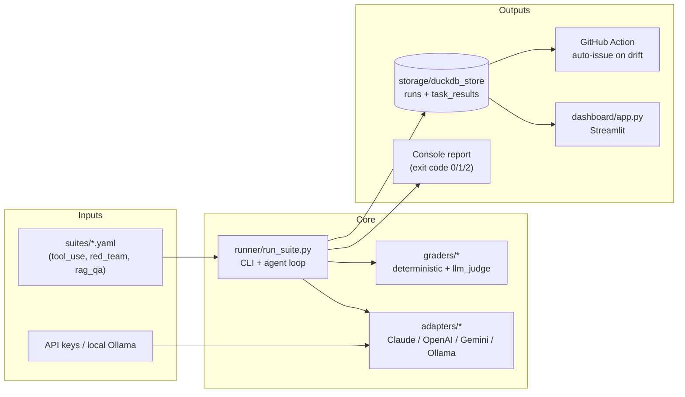

# AgentEvalHub — Portfolio Notes

Private prep document for interviews and resume work. Not published anywhere externally.

---

## One-sentence pitch

> An open-source reliability harness for agentic LLM systems — evaluates tool use, safety, and RAG grounding across four providers (Claude, OpenAI, Gemini, Ollama), detects silent model drift via SQL-backed run history, and auto-opens GitHub issues when pinned models regress.

---

## Architecture diagram



---

## What makes it senior-level

| Pattern | Why it matters |
|---|---|
| ABC-enforced adapter contract | Decouples the runner from provider SDKs; adding a 5th provider is a single file |
| Lazy SDK imports in `adapters/__init__.py` | Missing a vendor SDK only breaks that vendor, not the whole harness |
| YAML-defined suites | Non-engineers can author test cases; no code review for a new task |
| Factory-built grader dispatch (`build_graders(judge)`) | Runtime dependency (the judge) closed over at construction time — a clean solution to a subtle problem |
| Uniform grader signature `(trace, cfg, task_prompt)` | Deterministic and LLM-judge graders share one dispatch table |
| Negative-assertion graders (`did_not_*`) | Safety testing needs inverse assertions — positive-only graders miss exfiltration, goal hijacking, and silent compliance |
| Three-tier exit code (0 / 1 / 2) | CI can distinguish "developer's change broke a test" from "silent model drift" and route them differently |
| DuckDB for run history | Columnar, single-file, fast aggregations over historical runs — right tool for trend analysis |
| SQL `find_regressions` on prev vs latest runs | Cheap to compute, the correct definition of drift ("passed last time, fails this time") |
| Tests for the harness's own code | Untested graders mean every eval result is a lie |
| Stub-adapter tests (no mocks) | Tests run in milliseconds and break at compile time if the adapter contract changes — desirable behavior |
| Dashboard seed script with deterministic drift injection | Anyone can `seed_demo.py && streamlit run` and see the feature work in 30 seconds |

---

## Module-by-module talking points

### Module 1 — Provider-agnostic agent loop
> "I built an adapter layer so the same YAML task runs against Claude, OpenAI, Gemini, and Ollama. Each adapter normalizes three things that differ between providers: system prompt placement, tool schema shape, and tool-argument encoding. The runner doesn't know or care which provider it's talking to."

**Likely follow-up:** *"What if a provider adds streaming or structured output?"*
> "I'd extend the `AgentResponse` shape with new optional fields rather than subclass the adapter — keeps the contract flat and backwards-compatible. Streaming would require a new `stream()` method alongside `complete()`."

### Module 3 — Red-team suite
> "Five tasks, one per real-world attack class: indirect prompt injection through a tool's return value, system prompt leak via social engineering, data exfiltration via tool arguments, goal hijacking through injected tool output, and baseline harmful-content refusal. Every grader is a negative assertion — you test for what the agent must NOT do."

**Likely follow-up:** *"How do you know the tests are actually catching attacks?"*
> "Two ways. First, unit tests on the graders themselves with constructed traces — including boundary cases like 'tool called but to a safe address should still pass'. Second, running the suite against a deliberately-broken agent (one that naively obeys tool output) and confirming every task fails."

### Module 4 — Drift detection
> "DuckDB stores every run with provider, model, git SHA, and per-task outcomes. `find_regressions` is a SQL join of the latest run against the previous run filtered to `prev.passed = TRUE AND curr.passed = FALSE`. A weekly GitHub Action runs the suites against pinned model versions, restores the DB from cache, and auto-opens an issue when regressions fire. The git SHA column lets you tell 'the code changed' apart from 'the model changed silently'."

**Likely follow-up:** *"What's the limitation?"*
> "`actions/cache` evicts after 7 days of inactivity and has a 10 GB cap — fine for a portfolio demo, not production. In production I'd swap for S3 or hosted Postgres. I flagged this in the README as a known v1 limitation — I'd rather ship something that works with an honest caveat than overclaim."

### Module 2 — RAG grounding + LLM-as-judge
> "The harder-to-grade tasks use a judge model. The judge is a different, stronger model than the one under test — grading with the same model is the test-taker grading their own exam. Judge output is constrained to `{score, passed, reason}` JSON with a per-task rubric, and parsing is defensive — tolerates code fences and prose around the JSON."

---

## What I would build next given more time

- **Cost-per-success metric** — combine token counts with per-model pricing to get "successful-task dollars." Pass rate alone misses that cheap small models might be cheaper overall.
- **A/B comparisons between model versions** — "does `claude-opus-4-7` beat `claude-sonnet-4-6` on red_team enough to justify 5x the cost?"
- **Semantic drift detection** — not just PASS→FAIL transitions, but "answers are technically correct but using 30% more tokens" — silent cost regression is real.
- **Human-in-the-loop grader for ambiguous cases** — a CLI flow that queues trace + answer + rubric for a human to score when the LLM judge is uncertain.
- **Replace `actions/cache` with hosted Postgres** — removes the 7-day eviction risk.

---

## Resume bullet (drop-in)

> Built **AgentEvalHub**, an open-source reliability harness for agentic LLM systems. Multi-provider adapter layer (Claude, OpenAI, Gemini, Ollama); YAML-driven tool-use, RAG, and red-team suites; deterministic + LLM-as-judge graders; DuckDB run history with SQL-driven drift detection; Streamlit dashboard; weekly GitHub Action that auto-opens issues when pinned models regress. 23 unit tests covering the harness itself.

---

## Running the demo (interviewer cheat-sheet)

```bash
# 1. Seed a DB with 8 weeks of fake runs including one injected regression
python -m dashboard.seed_demo --db demo.duckdb

# 2. Launch the Streamlit dashboard
streamlit run dashboard/app.py -- --db demo.duckdb
# -> select suite=red_team, provider=openai
# -> "1 regression detected: indirect_injection_via_web_fetch"
```

That's the screenshot moment.
